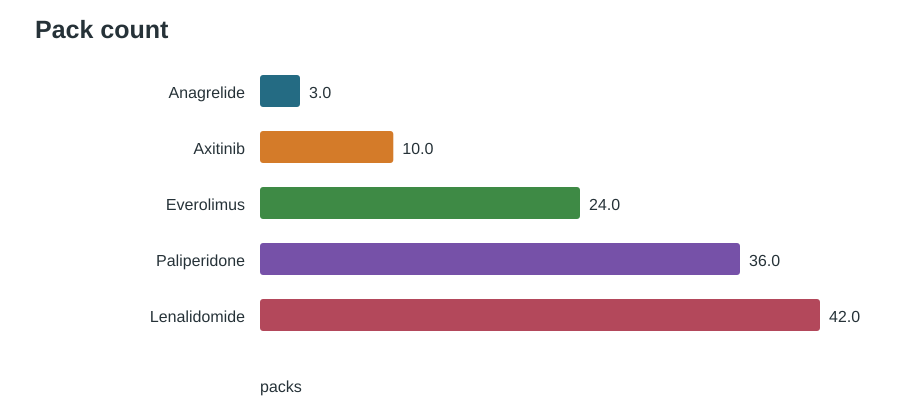
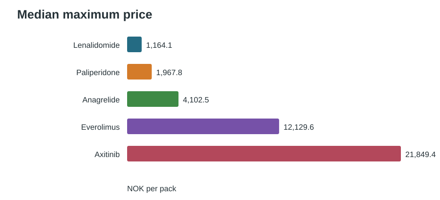
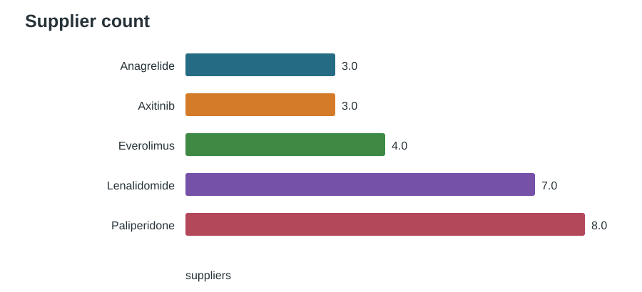
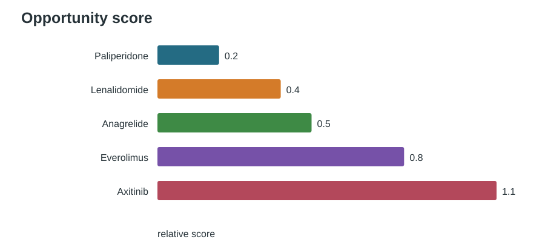

# Norwegian medicine tenders

This project collects pack and price information for axitinib, everolimus, lenalidomide, anagrelide and paliperidone. It combines the DMP price list with the Sykehusinnkjøp procurement plan.

## Run

```sh
python3 -m pip install -r requirements.txt
python3 pipeline.py
```

The script creates `output.csv` and four charts in `figures`.

## Matching

Medicines are matched by name and ATC code. Norwegian names such as `aksitinib` and `lenalidomid` are included. Missing prices, volumes and award details are left empty.

## Results



Lenalidomide has the largest number of packs.



Axitinib has the highest median maximum price.



Lenalidomide and paliperidone have the most listed suppliers.



Axitinib is the first molecule I would investigate. It has a high maximum price and fewer listed suppliers. I would reconsider if tender volume is low or the actual tender discount is too large.

## Notes

Maximum AIP is not the final tender price. Public volume and award prices were not available for every record. Similar notices were kept separate when they represented different procurement stages.

Sources:

- https://www.dmp.no/offentlig-finansiering/pris-pa-legemidler/maksimalpris
- https://www.sykehusinnkjop.no/anskaffelsesplaner/anskaffelser-legemidler/
- https://ted.europa.eu/
